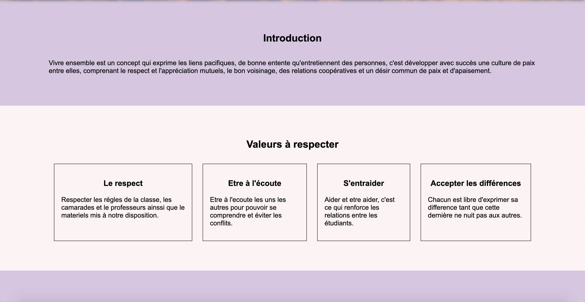

# Charte de vie

Apprendre à vivre ensemble,  les valeurs à respecter et les points à eviter.

## Contenu de la charte

* Introduction
* Valeurs à respecter
* Points à éviter
* Conclusion

## Captures d'écran

## Contributeurs

* [**Sara Derfoufi**](https://github.com/saboulhaya)
* [**Anne Taillandier**](https://github.com/anne076)
* [**Lea Levincent**](https://github.com/leavincent)
